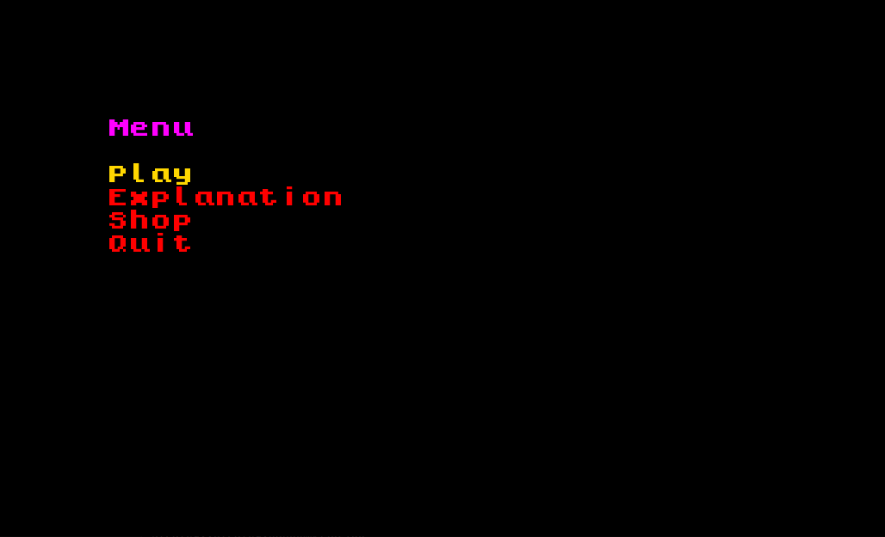
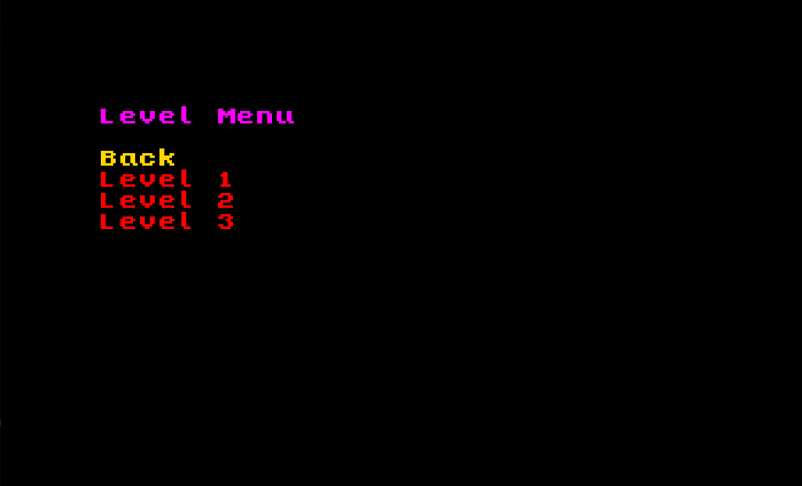
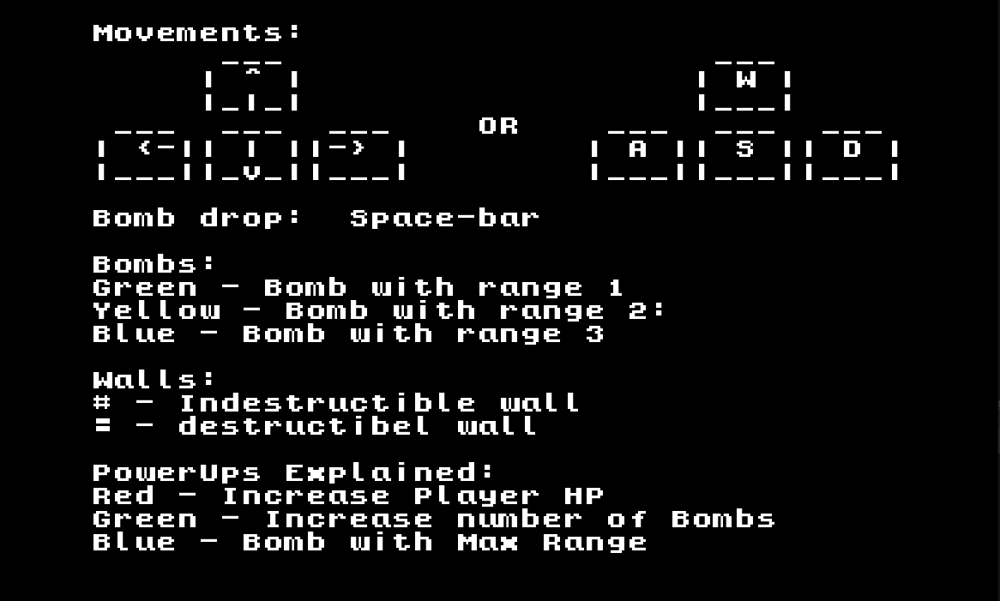
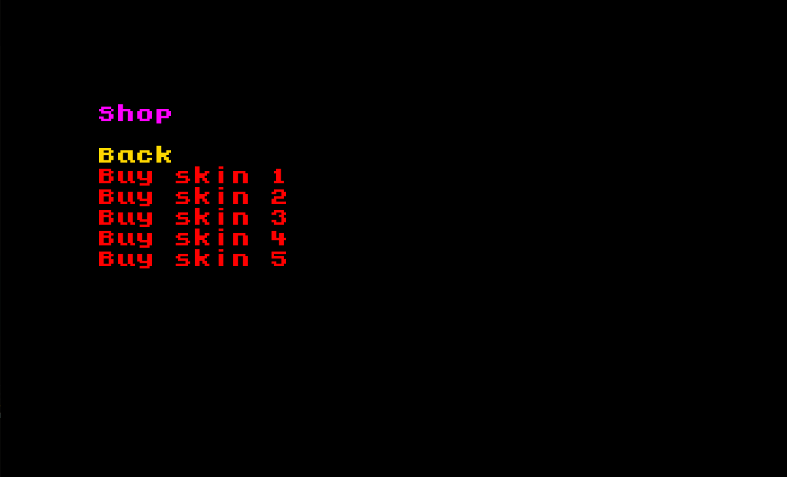
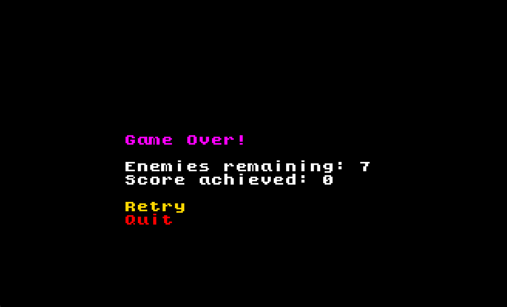
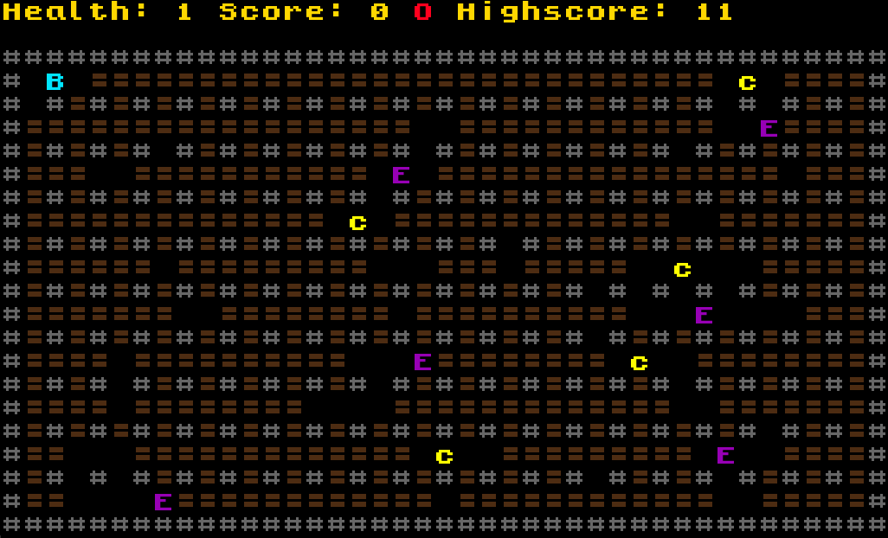
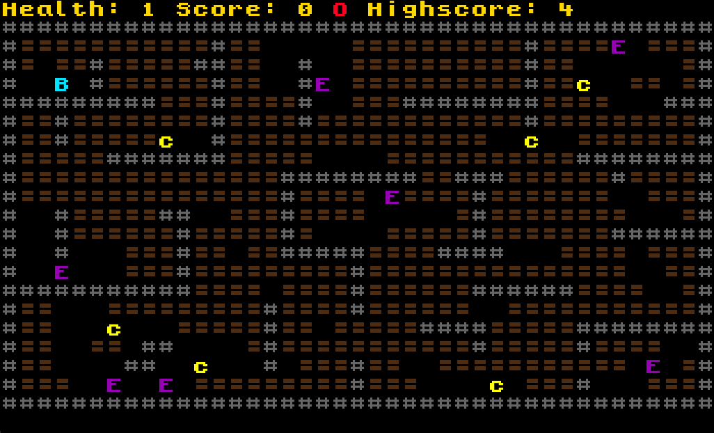
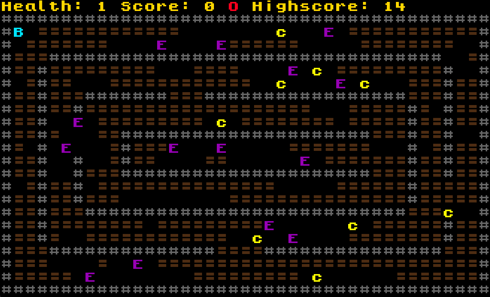

# Our Bomberman Game
## Game description
### The base game
BOMBERMAN is a game where a player places bombs in order to break certain walls and kill enemies. 
When all the enemies in the arena are dead, the player wins the game, if the player is touched by an enemy, 
he loses a health point. If the player's HP reaches 0, he loses the game.

This project was developed by Luís Tavares (up202108662@fe.up.pt), Miguel Leitão (up202108851@fe.up.pt)
and Tiago Azevedo (up202108699@fe.up.pt) for LDTS 2022/23.

### Our implementation
In our implementation of the game called BOOMBERMAN, everything happens in a 2D plane (the arena). 
There are breakable walls and non-breakable walls. Breakable walls can drop power-ups when destroyed.

Coins are just a novelty, they serve no real purpose in the game (collect them anyway to show how much better you are 😎). 
They can only be used to increase the score in the level they are collected in.

The player can move inside the arena where there are no walls. In case there is a breakable wall blocking the path, 
the player can drop a bomb and destroy it to make passage.

Bombs explode after a set amount of time of being placed down by the player, leaving behind a fiery trail along the 
explosion radius in a cross pattern. Watch out! 💣 You can get hurt too!

Power-ups ⚡ can either give extra radius to the bombs currently in the Boomberman's hands or extra bomb placement speed, 
use them right away because they don't last that long!

The monsters travel the arena in a random manner, and are not able to go through any type of wall. 
If a monster is within the radius of explosion of a bomb when it explodes, the monster dies 😵.

## Screenshots
These screenshots are taken in the actual game and show the funcionality of the different menus and gameplay.

### Game Preview

  

  <b><i>Gif 1. Boomberman the game</i></b>

 
 

### Menus

  

  <b><i>Fig 1. Main Menu</i></b>

 
 

  

  <b><i>Fig 2. Level Menu</i></b>

 
 

  

  <b><i>Fig 3. Explanation Menu</i></b>

 
 

  

  <b><i>Fig 4. Shop Menu</i></b>

 
 

  

  <b><i>Fig 5. Game over screen</i></b>

 
 

### Levels

  

  <b><i>Fig 6. Level 1</i></b>

 
 

  

  <b><i>Fig 7. Level 2</i></b>

 
 

  

  <b><i>Fig 8. Level 3</i></b>

 
 

**the full version of the README is in the docs folder**
