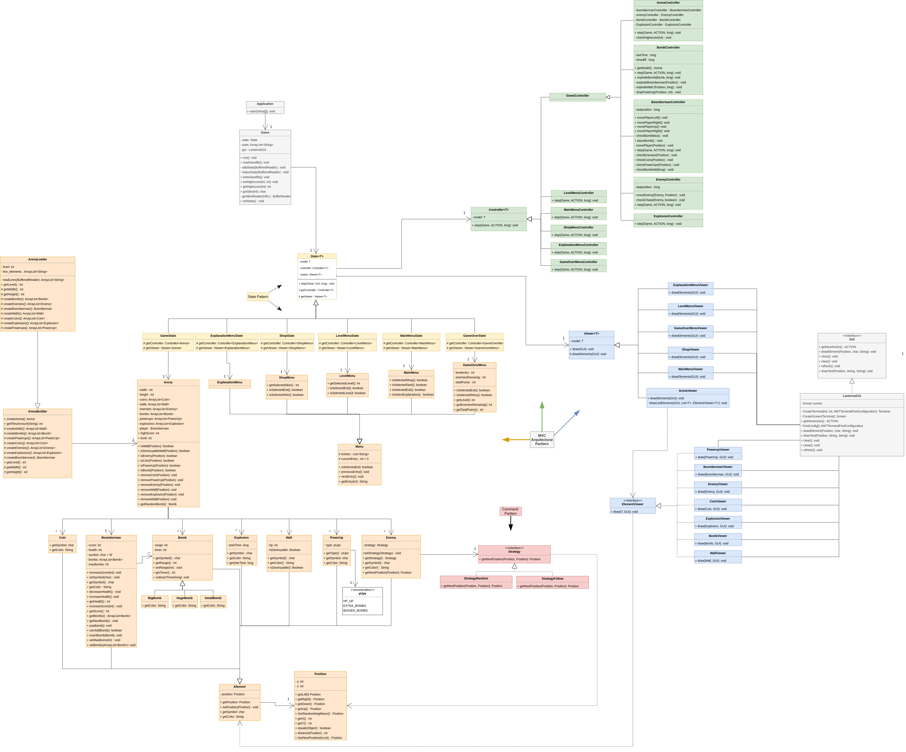
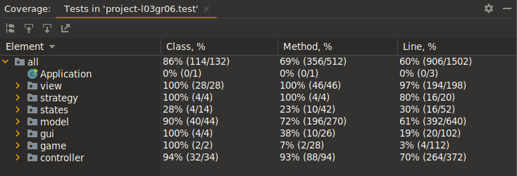

# LDTS_L03_Gr06

## Game description
### The base game
BOOMBERMAN is a game where a player places bombs in order to break certain walls and kill enemies. 
When all the enemies in the arena are dead, the player wins the game, if the player is touched by an enemy, 
he loses a health point. If the player's HP reaches 0, he loses the game.

This project was developed by Luís Tavares (up202108662@fe.up.pt), Miguel Leitão (up202108851@fe.up.pt)
and Tiago Azevedo (up202108699@fe.up.pt) for LDTS 2022/23.

### Our implementation
In our implementation of the game called BOOMBERMAN, everything happens in a 2D plane (the arena). 
There are breakable walls and non-breakable walls. Breakable walls can drop power-ups when destroyed.

Coins are just a novelty, they serve no real purpose in the game (collect them anyway to show how much better you are 😎). 
They can only be used to increase the score in the level they are collected in.

The player can move inside the arena where there are no walls. In case there is a breakable wall blocking the path, 
the player can drop a bomb and destroy it to make passage.

Bombs explode after a set amount of time of being placed down by the player, leaving behind a fiery trail along the 
explosion radius in a cross pattern. Watch out! 💣 You can get hurt too!

Power-ups ⚡ can either give extra radius to the bombs currently in the Boomberman's hands or extra bomb placement speed, 
use them right away because they don't last that long!

The monsters travel the arena in a random manner, and are not able to go through any type of wall. 
If a monster is within the radius of explosion of a bomb when it explodes, the monster dies 😵.

## Implemented Features
- **Menus:** Allows for multiple games to be played without having to restart the Application, the player can also browse through the multiple menus (Main Menu, Level Menu, Explanation, Shop) of the game because they are all connected.
- **Shop:** The shop contains multiple skins for the player to choose from.
- **HighScore saving system:** The game saves the best score yet in a file, so you know how much better you have gotten at Boomberman, or just compete with your friends locally!
- **Coins:** Coins are a collectible item that can be used to increase yoru score in a certain level, make sure to catch them all to get the max possible score!
- **Power Ups:** This little extra adds some more spice to the game, so you can kill your enemies faster and with more style! Snipe them from across the arena or make a barrage of bombs to guarantee a hit, it's up to you how to use them! Oh, you can also get one more Health Point.
- **Breaking Walls:** Some walls are more fragile than others, use bombs to break them, this is the main mechanic of the game and without it, you won't be able to reach most of the arena so get used to the sound of explosions!
- **Bomb Animation:** The bomb makes an explosion animation when it explodes, so you know when it's safe to walk around the arena again.
- **Dynamic level loading:** The game loads the levels dynamically, so you can add more levels to the game without having to change the code, just add the level to the levels folder and it will be loaded automatically into the level menu.
- **Dynamic skin loading:** The game loads the skins dynamically, so you can add more skins to the game without having to change the code, just add the skin to the skins folder and it will be loaded automatically into the shop menu.

## Planned Features
The wall switching button was planned to be implemented, but it was discarded due to the small amount of contribution it would have to
the main game mechanics. The idea was to have a button that would switch the walls between breakable and non-breakable, but this would
have been a very small feature that would not have added much to the game itself.
However, the idea was kept in mind and could be implemented in the future if the game is expanded.

## UML of the classes in the Game

  

  <b><i>Fig 1. UML of the classes in the Game</i></b>

## Design

### **Architectural Pattern**

#### **Problem in Context**

One of the most important parts of a project like this is to choose an efficient way to organize your code. It is essential to choose the most correct approach early on, as it can be extremely difficult to change it later in development.

#### **The Pattern**

We choose to implement the Model–View–Controller (MVC) architectural pattern. The MVC pattern consists of dividing the application into three main logical components: the model, the view, and the controller. Each of these components is created to handle specific development aspects of the application.
- The model only represents the data.
- The view displays the model data, and sends user actions to the controller.
- The controller provides model data to the view, and interprets user actions.

#### **Implementation**

  

  <b><i>Fig 2. Model, Controller and Viewer pattern design</i></b>

#### **Consequences**
- Break frontend and backend code into separate components, making it much easier to manage and make changes to either side without them interfering with each other.
- Facilitates simultaneous development.
- Facilitates testing, since all the components can be designed interface-based and tested using mock objects
- Facilitates code reuse, since the model can be used in multiple views and controllers.
- Facilitates code maintenance, since the code is divided into logical components.

### **Swap between the Main Menu and other menus or gameplay**

#### **Problem in Context**

While running the game, we need to be able to switch between moving and selecting options in the mainMenu and playing the actual game. 
The simplest approach would be to add some boolean flags and apply simple if/else statements ou switch statements within each of our methods in the class. 
This approach, however, might lead to code pollution and does not respect The Single Responsibility Principle.

#### **The Pattern**

To solve this problem we implement the State Pattern. The main idea of the State pattern is to allow the object to change its behavior without changing its class. This pattern allows us to address the identified problems, since separating the code for each behavior makes it easier to understand and modify it later on.

#### **Implementation**

Context: Defines an interface for the client to interact. It maintains references to concrete state object which may be used to define current state of object.
State: Defines interface for declaring what each concrete state should do.
ConcreteState: Provides implementation for methods defined in State.
In our implementation the Context is the Game class and the GameState and MenuState are the ConcreteStates.

  

  <b><i>Fig 3. State Pattern</i></b>

#### **Consequences**
- Improves Cohesion since state-specific behaviors are aggregated into the ConcreteState classes, which are placed in one location in the code.
- Avoid if/else statements and switch-case.
- Cleaner and more maintainable code.
- Easier to add new states.

### **Movement of the enemies in the game**

#### **Problem in Context**

Different enemies have a different way of moving in the game. This could be done by creating multiple classes derived from the Enemy class. But this would be counter-productive and would lead to the repetition of code and creation of unnecessary classes.

#### **The Pattern**

To solve this problem we implement the Command Pattern. The Command pattern allows us to create an interface that defines the necessary functions for it to be used. 
Then implement specific strategies that implement this interface and can behave in different ways.

#### **Implementation**

The Strategy interface defines the function getNextPosition which takes in an Element as an argument. 
This interface is then implemented in specific strategies such as StrategyRandom, which computes a random position to move the Enemy to,
or StrategyFollow which computes the position of the player and moves the Enemy towards it.

#### **Consequences**
- Avoid repetition of code.
- Ability to swap algorithms used inside an object at runtime.
- Cleaner and more maintainable code.
- We can now isolate the implementation details of an algorithm from the code that uses it.
- We can change the behavior of an object at runtime by changing the algorithm it uses.   

<!-- new -->
### **Arena Builder**

#### **Problem in Context**

The game has a lot of levels, and each level has a different layout. This means that we need to be able to create different layouts for each level.
The simplest approach would be to create a class for each level and hardcode the layout of the level. This approach, however, might lead to code pollution and does not respect The Single Responsibility Principle.
Instead of creating a class for each level, we can create a class that can create the layout of the level based on a text file.

#### **The Pattern**

This problem can be solved by implementing the Factory and Builder Pattern. The Builder pattern allows us to create different objects using the same construction process.
The Factory pattern allows us to create objects without exposing the creation logic to the client and refer to newly created objects using a common interface.

#### **Implementation**

The Factory class is the ArenaBuilder class. This class is extended by the ArenaLoader class, which is responsible for loading the layout of the level from a text file.
The Factory knows how to create the Arena, but only its subclasses can supply the components needed to create the Arena. The ArenaLoader class is one of such subclasses
and is responsible for loading the layout of the level from a text file.
The builder pattern is implemented in the ArenaLoader class which defines the ways of reading the files and constructing the individual elements to then pass to the factory.

    

  <b><i>Fig 4. Factory and builder design pattern</i></b>

#### **Consequences**
- Open/Closed Principle. We can introduce new types of Arenas without modifying existing code.
- The construction process of each element is more easily identified and can me modified without affecting the rest of the code.

### **GUI**
#### **Problem in Context**
The game needs a GUI to display the game and the menus. Since the Lanterna library is so large, it contains way more functionality than what we need
for our game, this violates the interface segregation principle.
Lanterna is also a low level module, so using it directly in our code (high level module) would violate the dependency inversion principle.
This led to a need for a high level module that would use the Lanterna library to display the game and the menus.

#### **The Pattern**
To solve this problem we implement the Facade Pattern. The Facade pattern provides an interface to a more complex underlying system.

#### **Implementation**

    

  <b><i>Fig 5. Facade design pattern</i></b>

We have an interface called GUI which defines the methods that the GUI should implement. The GUI interface is then implemented by the LanternaGUI class which uses the Lanterna library to display the game and the menus.

#### **Consequences**
- The GUI is now a high level module, which means that it is easier to understand and modify.
- We are able to take advantage of the Lanterna library without having to use it directly in our code.
- The GUI is now easier to test, since we can use mock objects to test it.

## Known code smells and refactoring suggestions
#### **Data Class**
Every model class is a Data Class. This is because they only contain data and no methods. This is not a problem, since the models are only used to store data and are not used to perform any operations on the data.

#### **Long Method**
The Game class has a long method called run(). This method is responsible for running the game and switching between the different states of the game.

#### **Large Class**
Some classes like Game, Arena, ArenaLoader and LanternaGUI contain many fields and methods. 
The Game class has the logic to read the save files and write to them, so it needs fields and methods to handle this,
we believe it's justified since it's the main class of the Application and should be responsible for the logic of the game states/saves.
The Arena class has all the elements and methods to add or remove these elements so it will be a large class, but there is no way around that since it would make no sense to split it into multiple classes.
The ArenaLoader class has a lot of fields and methods because it is responsible for loading the layout of the level from a text file, it would also not make sense to split it into multiple classes.
The LanternaGUI class has a lot of fields and methods because it is responsible for displaying the game and the menus, it would also not make sense to split it into multiple classes.

<!-- TODO ADD REST OF CODE SMELLS AND REFACTORING SUGGESTIONS-->

## Testing
### Screenshot of coverage report

    

  <b><i>Fig 6. Coverage report</i></b>

Testing was done across most classes, with the State subclasses being the exception. These were not covered since they have the same inner workings as the State superclass, (with the exception of 2 get functions) which was tested extensively. Mockito and Asserts were used widely on testing - Mockito was used to mock various classes, such as Game, Screen and TextGraphics (which are part of Lanterna), GUI and various Menu model classes, as well as verifying method calls. As for Asserts, these were used to confirm whether methods were doing what they were supposed to (in other words, verify return values, changes in class variables...).

### Link to the mutation test report
[Mutation tests](../build/reports/pit/202212231252/index.html)

Mutation testing was also done, even though most mutations could not be eliminated. To prepare the Arena for testing, all the objects in the game have to be initialized, even if only with an empty list. Pitest considers most of these initializations as mutations, even though they can't be removed from the test suite.
Asserts were also another source of mutations. If a test function has no Asserts, it will pass by default. Because of this, Pitest also considers these lines of code as mutations, even though they are the most important part of testing.

## Self-evaluation

- Luis Tavares: 40%
- Miguel Leitao: 40%
- Tiago Azevedo: 20%
